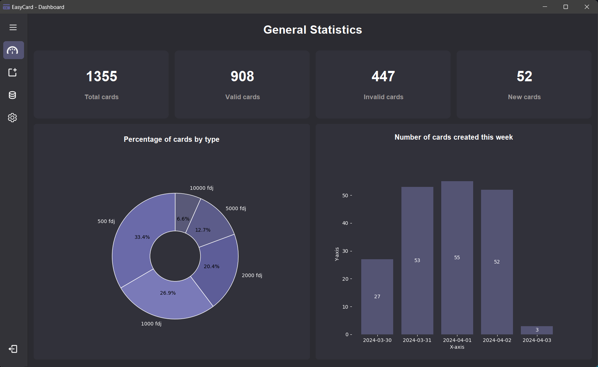

<p align="center">
  
</p>

<p align="center">
    <strong align="center">EasyCardGUIDesktop</strong>
</p>

## Project Description

EasyCardGUIDesktop is a graphical user interface (GUI) application designed to complement the EasyCardBackend project. This desktop application provides a user-friendly interface for managing credit cards and utilizes artificial intelligence to extract credit card numbers from images.

## Features

- **Auth**: Offers a secure login mechanism to ensure that only authorized users can access the application.
- **Credit Card Management**: Enables users to manage their credit cards efficiently.
- **Number Extraction**: Uses AI to extract credit card numbers from images.
- **Dashboard**: Displays statistics on the total number of cards, valid and invalid cards.
- **Data Table**: Presents a detailed view of credit card data in a tabular format.
- **Appearance Theme**: Allows users to customize the visual theme of the application, providing options such as a light or dark mode to suit user preferences.

## Demo

To see EasyCardGUIDesktop in action, watch the demonstration video below:

[](./assets/demo/Demo-EasyCardGUIDesktop.gif)


## Prerequisites

Before setting up the EasyCardGUIDesktop, ensure that the EasyCardBackend is up and running. The backend API is necessary for managing credit cards and extracting credit card numbers using artificial intelligence.

- EasyCardBackend: Follow the instructions in the [EasyCardBackend repository](https://github.com/Macktireh/EasyCardBackend.git) to set up the backend service.
- Python 3.12 or higher
- Install [PDM](https://pdm-project.org/)

## Getting Started

### 1. Clone the Project

```bash
git clone https://github.com/Macktireh/EasyCardGUIDesktop.git
```

```bash
cd EasyCardGUIDesktop
```

### 2. Install Dependencies

```bash
pdm install
```

### 3. Configuration

Before running the EasyCardGUIDesktop application, you need to configure it to connect to the EasyCardBackend service. Follow these steps to set up the connection:

#### 3.1. Set Up the Backend Service

Ensure that the EasyCardBackend is running. You can find the setup instructions in the [EasyCardBackend repository](https://github.com/Macktireh/EasyCardBackend.git).

#### 3.2. Configure the Frontend Application

In the EasyCardGUIDesktop application, locate the configuration file named `config/settings.py` and set the `BACKEND_URL` variable to the URL of your running EasyCardBackend service.

```python
BASE_API_URL = "http://localhost:5000/api"  # Replace with the actual URL of your backend
```

### 4. Launch the Application

```bash
pdm start
```

## License

This project is licensed under the [MIT License](LICENSE).

